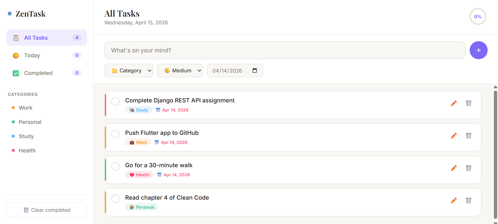
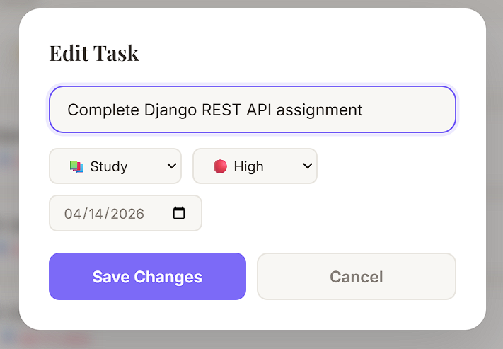
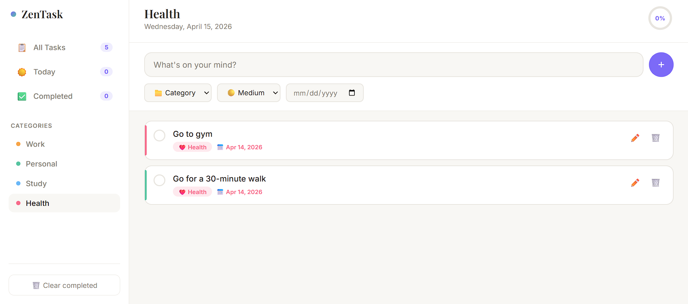

<h1 align="center">✅ ZenTask</h1>

<p align="center">
  <strong>A beautiful, minimal task manager designed for calm focus and productive flow.</strong><br/>
  Organise tasks by category, priority, and due date — with smooth animations and localStorage persistence.
</p>

<p align="center">
  
  
  
  
  
</p>

---

## 📸 Screenshots

### 🏠 Homepage — All Tasks View
> The main dashboard features a clean two-panel layout: a sidebar for navigation and filtering on the left, and the task list on the right. Each task card shows its category badge (Study, Work, Health, Personal), color-coded priority bar, due date, and edit/delete actions. A circular progress ring in the top-right tracks completion rate.



---

### ✏️ Edit Task Modal
> Clicking the edit (pencil) icon opens a smooth modal overlay. You can update the task title, switch its category, change the priority level (High/Medium/Low), and adjust the due date — then save with one click.



---

### 🏷️ Category Filter — Health Tasks
> Click any category in the sidebar to instantly filter the task list. Here the **Health** category is selected, showing only health-related tasks. The sidebar highlights the active filter and the header updates to reflect the current view.



---

## ✨ Features

| Feature | Description |
|---|---|
| ➕ Add Tasks | Title, category, priority level, and due date |
| ✏️ Edit Tasks | Smooth modal editor to update any task |
| 🗑️ Delete Tasks | Animated slide-out on removal |
| ✅ Complete Tasks | Circle checkbox to mark done with strikethrough |
| 📁 4 Categories | Work, Personal, Study, Health — each color-coded |
| 🔴 3 Priority Levels | High / Medium / Low with side bar indicator |
| 📅 Due Dates | Overdue dates highlighted red, today highlighted amber |
| 🔍 Smart Filters | All / Today / Completed / by Category |
| 📊 Progress Ring | Circular completion rate indicator (top-right) |
| 💾 Local Storage | All tasks auto-saved — persists across sessions |
| 📱 Responsive | Collapsible sidebar on mobile devices |

---

## 🛠️ Tech Stack

| Technology | Purpose |
|---|---|
| HTML5 | Semantic sidebar + main panel layout |
| CSS3 | Zen light theme, pastel cards, modal, slide animations |
| JavaScript ES6+ | Full CRUD, category filtering, localStorage persistence |

---

## 📁 Project Structure

```
zentask-app/
├── index.html        # App layout: sidebar, task list, edit modal
├── style.css         # Zen light theme with pastel category colors
├── script.js         # Task logic, filtering, localStorage, demo seed data
└── Screenshots/
    ├── HOMEPAGE.png
    ├── EDIT_TASK.png
    └── SEARCH_BASED_ON_CATEGORY_OF_THE_TASK.png
```

---

## 🚀 Getting Started

```bash
git clone https://github.com/qasim-safi/zentask-app.git
cd zentask-app
open index.html
```

No Node.js, no npm, no build step. Just open and use — demo tasks are pre-loaded automatically.

---

## ⌨️ Keyboard Shortcuts

| Key | Action |
|---|---|
| `Enter` (in task input) | Add task |
| `Enter` (in edit modal) | Save changes |
| `Escape` | Close modal |

---

## 👨‍💻 Developer

**Qasim Safi** — BS Software Engineering Student  
🌐 Django Web Dev | 📱 Flutter App Dev | 🐍 Python & Java

[](https://github.com/qasim-safi)

---

## 📄 License

MIT License — free to use, modify, and distribute.
